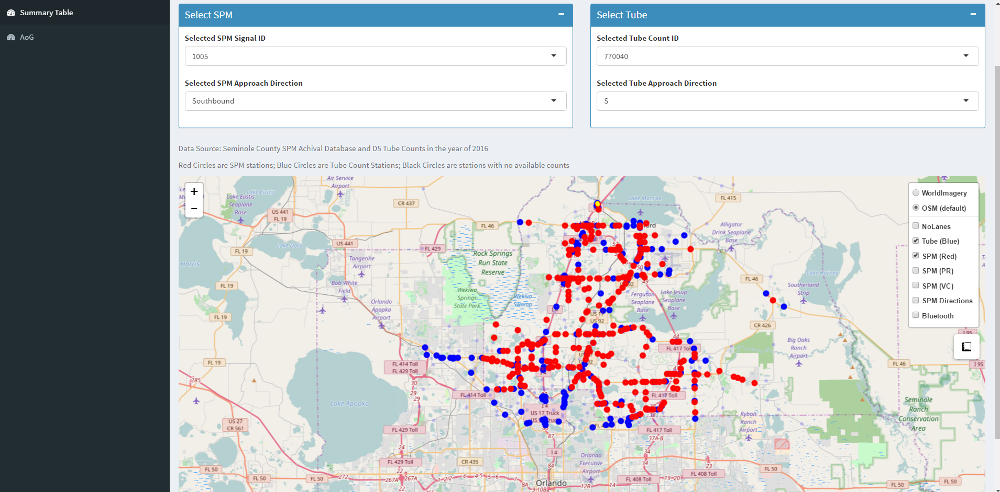

Overview
========

This project is based on Signal Performance Metric data from Seminole County, Florida. A supplementary data dashboard for visualization purpose can be accessed here: [Link for Dashboard](https://shiwang0211.shinyapps.io/Dashboard_SPMandTube/). Raw data are not included in this repository.

The analysis include:

-   Comparison between SPM and FDOT PTMS Counts
-   Development of prediction model using **Linear Regression** and **Random Forest**
-   Comparison between SPM and Bluetooth Travel Time Data (Ongoing)
-   Visualization for other performance measures

The packages used for the analysis include [leaflet](https://rstudio.github.io/leaflet/), [ggplot](http://ggplot2.tidyverse.org/index.html), [plotly](https://plot.ly/r/), [data.table](https://github.com/Rdatatable/data.table), etc.

Below is an Illustration of the dashboard for study area and initial results.

Contact
=======

Shi Wang (<shiwang0211@gmail.com>)
